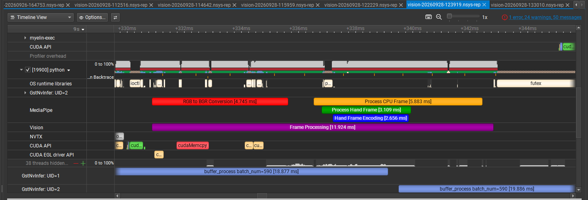
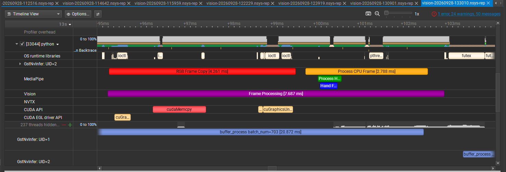

# Optimizing real-time AI on Jetson Orin Nano

I profiled and optimized a live camera, computer-vision, and local-LLM stack on an NVIDIA Jetson Orin Nano. Moving YOLOv8n inference from CPU to TensorRT FP16 raised the measured camera stream from **8.5 to 30.0 FPS** (the camera's 30 FPS limit). Later work moved detection and pose into DeepStream, reduced browser-frame CPU work, and isolated local Qwen inference from the video process.

This repository is my performance engineering portfolio: the results and decisions are here in the README; the linked notes preserve the measurements and failure investigations behind them.

## Measured results

| Problem | Change I made | Observed result |
| --- | --- | --- |
| CPU inference limited the YOLOv8n stream | Moved inference to PyTorch CUDA, then exported a TensorRT FP16 engine | **8.5 → 23.7 → 30.0 FPS** in the application stream; 30 FPS was the camera ceiling. |
| CPU color conversion added cost to the browser/hand path | Negotiated BGR output through GPU `nvvideoconvert` and removed `cv2.cvtColor` | **3.10 → 1.61 ms** for CPU frame mapping/color preparation in short live samples. |
| Frame callbacks prepared compressed images for an asynchronous hand worker | Standardized the later pipeline on RGB, moved hand transfer to shared memory, and updated output encoders | Callback **p95: 16.66 → 13.25 ms**; main-process CPU across six cores **21.77% → 19.68%** in two 30-second captures. Worker CPU and total-system savings were not measured. |
| TensorRT builder settings had an unknown payoff | Built separate YOLO26s detector and pose plans at optimization levels 3 and 5, then benchmarked each | Level 5 gave **+8.9% detector** and **+6.9% pose** throughput in isolated 10-second `trtexec` runs. |
| CPU-only local Qwen responses were slow | Built `llama-cpp-python` with CUDA and offloaded supported layers | One command prompt fell from **14.3 → 4.52 s**; a conversational sample fell from **14–18 → 6.44 s**. |

## RGB and shared-memory frame processing

The September 28 Nsight Systems comparison measured the synchronous frame callback and the separate MediaPipe recognition call before and after the RGB conversion. All latency values are milliseconds.

| Measurement | Before p50 / p95 / p99 | After p50 / p95 / p99 |
| --- | ---: | ---: |
| Frame callback | 7.63 / 16.66 / 20.12 | **6.53 / 13.25 / 18.60** |
| Hand submission in the camera callback | 2.77 / 3.63 / 4.78 | **0.38 / 0.65 / 0.79** |
| MediaPipe recognition | 77.28 / 122.33 / 126.76 | 83.03 / 119.92 / 129.38 |

Average utilization over each approximately 30-second capture:

| Measurement | Before (`123919`) | After (`130901`) | Scope |
| --- | ---: | ---: | --- |
| Main-process CPU utilization | **21.77%** | **19.68%** | Scheduled CPU time divided by capture time and six CPU cores. |
| Hardware GPU utilization | Not captured | Not captured | No hardware utilization samples are available in these reports. |

Main-process CPU decreased by **9.6% relative**. CPU scheduling coverage excludes the separate MediaPipe, recording, and browser workers, so this does not establish total application CPU savings.

The callback became shorter, while recognition latency showed no consistent improvement. Frame-callback latency excludes background completion and is not camera-to-browser latency.

The [full RGB comparison](notes/rgb-shared-memory-comparison.md) includes sample counts, stage timings, measurement methods, and the derived JSON data. Scene activity was not held identical, and several pipeline components changed together.

### Visual benchmarking log

**Before — BGR conversion and JPEG hand-frame preparation**

Capture: `vision-20260928-123919.nsys-rep`.

This frame's purple `Frame Processing` range spans **11.924 ms**. Within it,
`RGB to BGR Conversion` takes **4.745 ms**, and `Process CPU Frame` takes
**5.883 ms**, including **2.656 ms** of `Hand Frame Encoding`.

**After — RGB frames and shared-memory hand transfer**

Capture: `vision-20260928-133010.nsys-rep` (a later RGB run).

This frame's purple `Frame Processing` range spans **7.687 ms**. `RGB Frame Copy`
takes **4.261 ms**, and `Process CPU Frame` takes **2.788 ms**. Within the latter,
`Process Hand Frame` takes **537 µs (0.537 ms)**, including **391.5 µs (0.3915 ms)**
of `Hand Frame Snapshot` (timings supplied from the expanded Nsight ranges).
JPEG hand-frame encoding has been replaced by this snapshot/submission work;
preparation and recognition continue in the sender thread and MediaPipe process.

These screenshots show individual frames at different timeline zoom levels.
Their durations are examples, not averages or percentiles, and nested ranges
should not be added together. The table above compares captures `123919` and
`130901`; the after screenshot illustrates the RGB path in the later `133010`
capture and is not the source of that table's statistics.

## TensorRT optimization level 3 vs 5

I created a benchmarking script that automatically builds and compares FP16-capable YOLO26s pose and detector TensorRT plans across builder optimization levels. On the same Orin Nano with TensorRT 10.16.2, the script built level 3 and level 5 plans, ran each through trtexec for 10 seconds after a 1-second warm-up, collected latency and throughput metrics, and selected the faster plans locally. Build time is a one-time cost; the other columns measure isolated engine inference.

| Model | Level | Throughput (qps) | Mean latency (ms) | GPU mean / p99 (ms) | Build time (s) |
| --- | ---: | ---: | ---: | ---: | ---: |
| Pose | 3 | 146.832 | 7.198 | 6.804 / 7.085 | 440.30 |
| Pose | **5** | **156.991** | **6.791** | **6.364 / 6.543** | 1,101.53 |
| Detector | 3 | 155.401 | 6.824 | 6.429 / 6.714 | 38.34 |
| Detector | **5** | **169.218** | **6.312** | **5.904 / 6.184** | 175.52 |

Level 5 increased throughput by 6.9% for pose (146.8 → 157.0 qps) while reducing mean latency by 0.407 ms (5.7%). For detection, throughput increased by 8.9% (155.4 → 169.2 qps) while mean latency decreased by 0.512 ms (7.5%). GPU mean inference time improved by 0.440 ms (6.5%) for pose and 0.525 ms (8.2%) for detection. These gains came at approximately 2.5× and 4.6× longer one-time build times, respectively. Both level 5 plans were selected by the comparison script. The [full benchmark note](notes/tensorrt-builder-comparison.md) records the configuration and limits.

## System and engineering decisions

The production path grew from a Python YOLO camera stream into **CSI camera → Argus/GStreamer → DeepStream YOLO26s detection and pose → hand-gesture worker → browser MJPEG**. I decoupled browser publication from camera/inference cadence, removed a JPEG encode/decode round trip before CPU hand processing, and used a secondary DeepStream pose engine on person regions. I kept MediaPipe for hands when it recognized closed-fist gestures more reliably than a lower-CPU TensorRT hand path.

An intermittent video crash was a separate performance and reliability problem. I correlated DeepStream buffer-copy failures with kernel GPU MMU faults and CUDA error 700. Rebuilding the TensorRT engines fixed a device/profile warning but did **not** stop the crash. On the JetPack 6.2 / DeepStream 7.1 stack, switching the affected `nvvideoconvert` copies to VIC (`copy-hw=2`) addressed the observed failure; the stream held about 30 FPS through the recorded validation window. That workaround is specific to the older stack, not a blanket recommendation for every Jetson setup.

For voice, I moved Qwen into a separate warm service after loading it inside the DeepStream process destabilized the pipeline. That traded roughly 607 MB of idle resident memory in one sample for process isolation and faster repeated responses.

## Evidence and limits

- **Hardware:** Jetson Orin Nano developer kit, 8 GB class, Ampere GPU (compute capability 8.7); CSI camera; YOLO, TensorRT, DeepStream, MediaPipe, and local Qwen/`llama.cpp`.
- **Measurement context:** Stream FPS includes the enabled camera, inference, hand/pose, overlay, and encoding stages. The 30 FPS camera cap limits what a stream FPS result can show. The builder-level comparison measures each TensorRT engine alone, not the full DeepStream pipeline.
- **Confidence:** These are measurements from one device. Many are short operational samples rather than repeated controlled trials. Power mode and clocks can affect comparisons; instantaneous GPU clocks were not recorded for every run.

Read the [case studies](notes/case-studies.md) for the changes and tradeoffs, the [RGB/shared-memory comparison](notes/rgb-shared-memory-comparison.md) and [TensorRT level 3 versus 5 comparison](notes/tensorrt-builder-comparison.md) for full benchmark numbers, or the sanitized [May field log](notes/field-log.md) and [later stream log](notes/recent-stream-log.md) for the chronological record. Commands in the logs document the configuration at the time and may no longer match the current application.

The production application, model weights, TensorRT plans, recordings, and device-specific configuration are outside this notes repository. Local account paths and LAN addresses in the historical logs were replaced with documentation examples.
